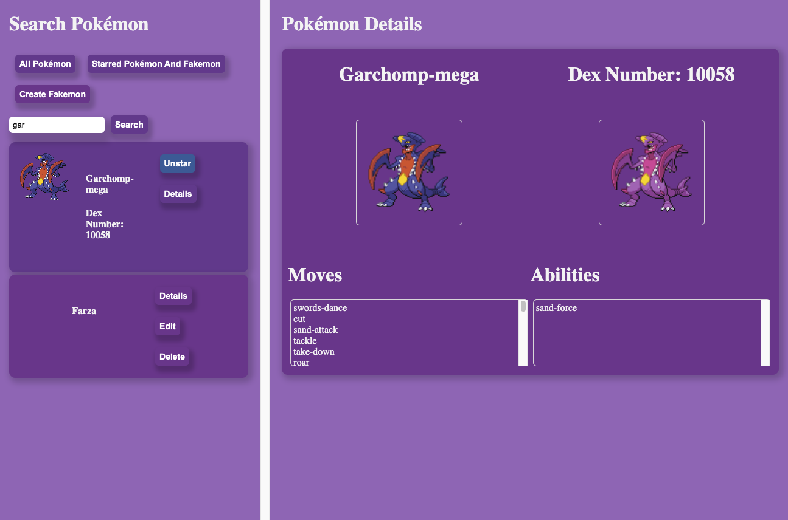
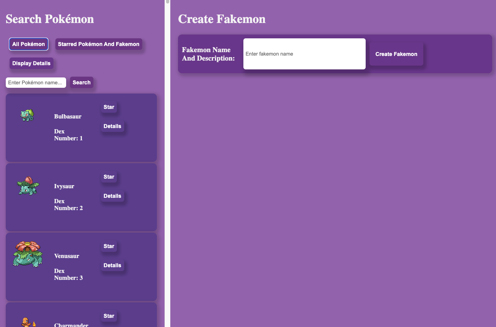

# Project Overview

## Technologies Used

- React
- Axios - (axios.call + Promise.all)
- Classes
- Functions
- React states
- React props
- React Hoisting
- Cache-control + max-age

## Goals

Learn more about axios calls

Become more familiar with class and functional components in React

Learn abt cache-control

## Install

1. Fork and Clone this repo (clone with $ git clone {github repo url})
2. In terminal cd to the new folder
3. in terminal type $ npm install
4. in terminal after npm is installed, type $ npm start to run it
## Plan

I wanted to create a website that would allow users to view information about any pokémon (or form i.e. megas or regional variants) such as their potential moves and abilities. In addition I wanted to give users the oppurtunity to create their own fakemon.

## Achieved Techincal Goals

Add a new item to a list - Done
Mark the item as complete/favorite/(watch, read, listen) later/flag/etc - Done
Edit an item from a list - Done
Remove an item from a list - Done
Clear/delete all items - Done
Clear/delete only marked items - Done
Fetch data from at least one 3rd party API using Axios or fetch. - Done
Make frequent Git commits with descriptive messages, explaining your commit. - Done

## User stories

As a user, I want to be able to search for specific pokémon

As a user, I want to be able to star a pokémon

As a user, I want to be able to view a pokémon's details

As a user, I want to be able to unstar a pokémon

As a user, I want to be able to make a fakemon

As a user, I want to be able to edit a fakemon

As a user, I want to be able to delete a fakemon

As a user, I want to be able to use the website without lag after the initial setup

All achieved
## Future Goals

Expand upon the fakemon creation method - types, moves, abilities - EXTRA - give users the oppurtunity to make their own sprites for their fakemon - SUPER EXTRA - make users enter keywords and have a program draw the fakemon for them

Add pokémon types to the details view

Make the website multipage via React Router

Refactor code to use React Hooks

Make different list displays easier to tell apart

## New concepts learned

The PokeApi I used for this project makes use of urls within its data structures, that lead to more datastructures. In my first version of the project, I wasn't navigating the api efficiently, which caused all sorts of issues. I ultimately decided to cut my losses and restart my project with a new goal in mind: do all my axios calls during the page's initial render and sotre all pokémon in a mainList. 

```js
  componentDidMount() {
    const apiURL = 'https://pokeapi.co/api/v2/pokemon?offset=0&limit=1279';
    axios.get(apiURL).then(response => response.data)
    .then(result => {
      return result.results
    }).then(results => {
      const urls = results.map(result => {
        return result.url
      })
      return urls
    }).then(urls => {
      this.setState({
        allUrls: urls
      })
      return urls;
    }).then(urls => Promise.all(urls.map((url) => {axios.get(url).then(response => {
      const item = response.data;
      this.setState(prevState => {
        return{
          mainList: [...prevState.mainList, item]
        }
      })
    })}))).then(() => {this.setState(prevState => {
      return {
        mainList: prevState.mainList.sort((a, b) => (a.id < b.id) ? 1 : -1)
      }
    })}).catch(err => {
      console.log(err)
    })
  }
```

This chunk of code solved my API issues - More Specifically, Promise.all(urls.map((url) => {axios.get(url)...})


Promise.all will wait until all promises are resolved (successfully or not). Within the Promise.all, I used map to get the data from each url in the 1279 long urls array. Then I used this.setState(prevState => {}) to append this.state.mainList
## Interface

I have removed the search button as it wasn't necessary




### Example Code for caching data

npm install node-cache
import node-cache
```js

const request = require('request');
const NodeCache = require('node-cache');
const API_ENDPOINT = 'http://pokeapi.co/api/v2/pokemon/';
const cache = new NodeCache();

// try getting data from the cache first
cache.get('my-pokemon', (err, data) => {
  
  // return early if there's an error or data is available
  if (err) return console.log(err);
  if (data) return console.log('Obtained data from cache:', data);

  // if no error, but data was not found, make the API request
  request(API_ENDPOINT, (error, response, body) => {
    
    // if successful, store the body in the cache
    if (!error && response.statusCode === 200) {
      
      cache.set('my-pokemon', body, (err, success) => {
        
        // return early if there's an error or no success
        if (err || !success) return console.log(err);
        
        console.log('Queried API, stored data in cache', body);
      });
    }
  });
});
```